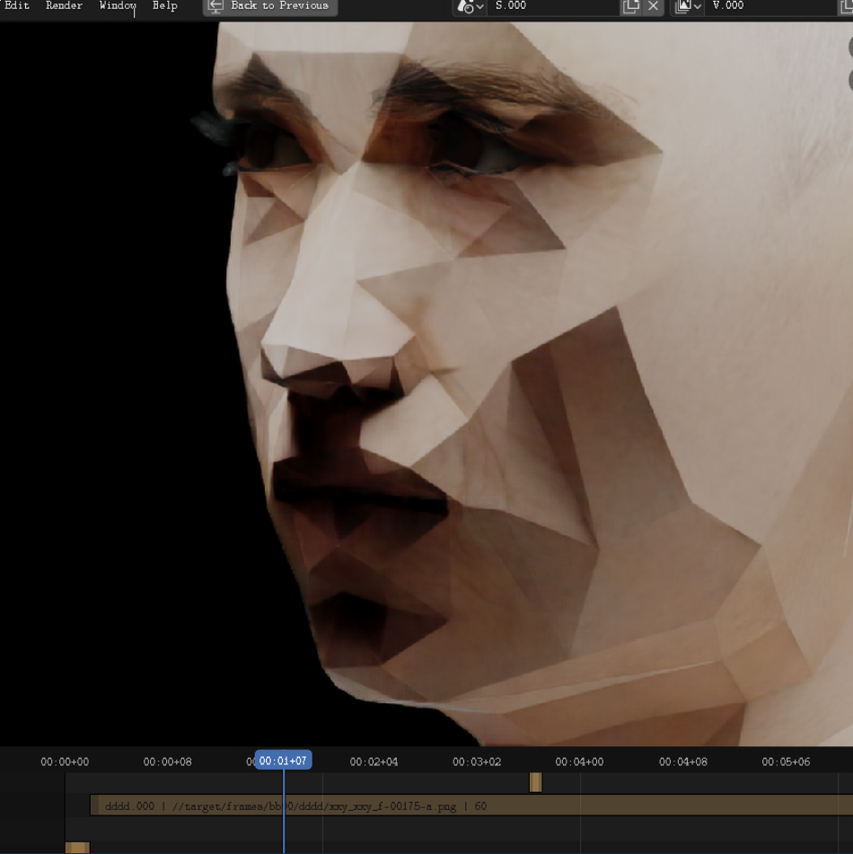

= process_vse_isr
Gabriel Montagné Láscaris-Comneno <gabriel@tibas.london>
v0.0.1

Connects https://github.com/idealo/image-super-resolution
with https://github.com/gabrielmontagne/blender-addon-process-vse-strip
using https://github.com/gabrielmontagne/xyy.

To use, install the dependencies from xyy, create a TF 2.0.0 environment and run the server:

----
usage: process_vse_isr [-h]
                       [--weights {psnr-large,psnr-small,noise-cancel,gans}]

optional arguments:
  -h, --help            show this help message and exit
  --weights {psnr-large,psnr-small,noise-cancel,gans}
----

